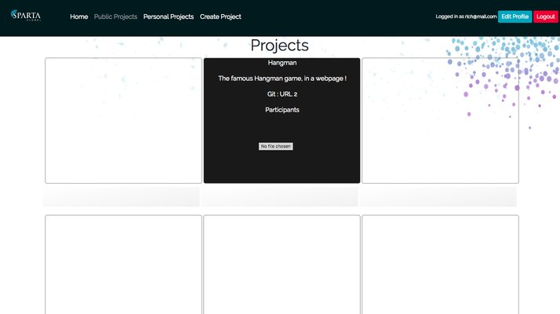
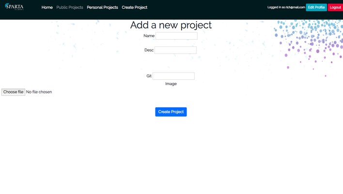
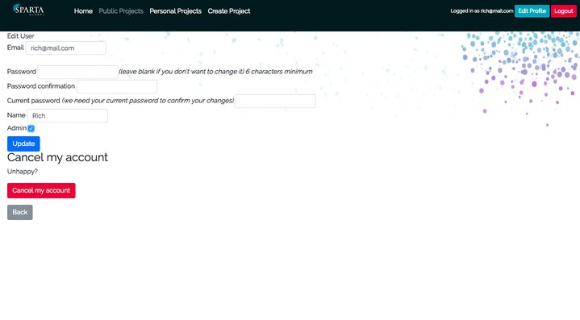
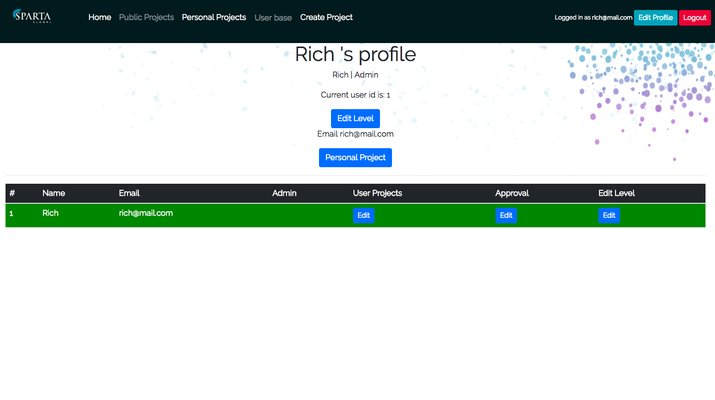

# Project 2

The web application was developed in Sublime with Ruby-on-Rails as the primary programming structure for the project. HTML-on-Rails, JQuery JavaScript and CSS with Bootstrap were also implemented into the application. Project 2 utilises many Gemfiles such as jquery-rails, popper_js (1.12.3), animate.css-rails (3.2), bootstrap-sass (3.3.6).

## Functionality
### Visitors
A visitor can enter the web application without having to sign in or creating a user account, although visitors may create accounts if they wish to. Visitors can view previous Sparta Global Trainee projects from tiles that are neatly displayed on the homepage.

### Creating a user account
Visitors are required to fill in a short sign-up form which takes an email address, password confirmations and the user's full name.

### Log-in Users
Once a user has created a log-in account they are given direct access to creating new projects. New project tiles take the project's name, a short description of the project and an image and GitHub url. They are also required to attach the project file. The created project will then appear on the homepage, and can be viewed in the user's personal projects page. Log-in may edit their user profiles if they would like to change passwords. If a profile is edited, the user must reconfirm their password to enable changes to be made.

### Admin Users
Admin users have the priviledge of a 'user base' webpage, which enables admin user's to edit, create and destroy projects. Admin users may add/remove project approvals and add/remove log-in user's admin status.

## Screenshots
### Homepage

### New Project

### Edit User

### User Base

## Authors
This project was developed by Karl Gharios, Luke Heudebourck and Priyam Patel for Sparta Global.